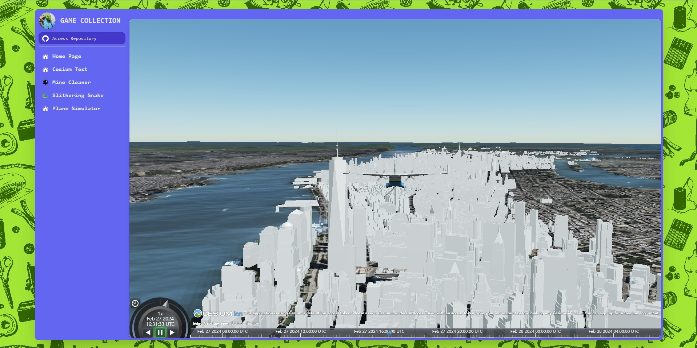

# SandCastle-Roger

我用来测试各种东西，实现各种想法的沙盒
- 测试网站：https://sandcastle-roger.pages.dev/


## 主要内容

使用vite+react+ts搭建。使用Cesium实现三维地球相关的内容

- 启动项目
```
yarn install
yarn dev
```

- [x] 完成项目初始化
  - [x] 仿制飞书界面构建主界面
  - [x] 卡片式分页（没搞路由）
  - [x] 过渡动画添加
- [ ] 构建homePage
- [ ] 移植并改进扫雷
- [x] 构建贪吃蛇项目
  - [x] 性能优化
- [ ] 优化CesiumSandCastle的小飞机项目（HeadingPitchRoll）
  -  [飞机项目文档](./src/pages/Plane/README.md)
- [x] 部署网站
